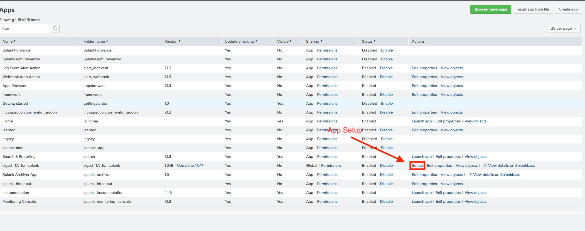
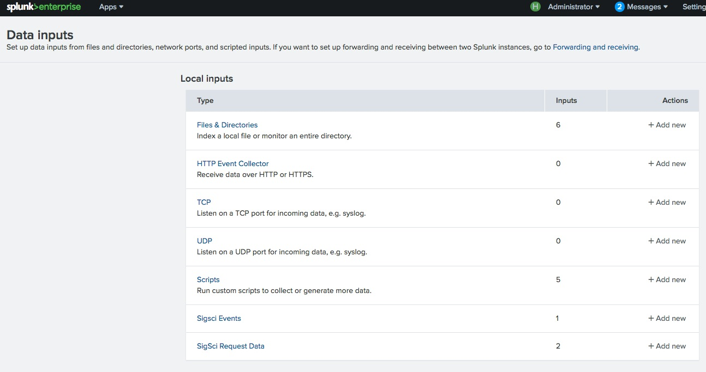

# Signal Sciences TA for Splunk App

This app for Splunk connects to the Signal Sciences API in order to pull data into Splunk. 

## Signal Sciences REST API Endpoints used

1. https://dashboard.signalsciences.net/api/v0/auth
2. https://dashboard.signalsciences.net/api/v0/corps/{{corp}}/sites/{{site}}/analytics/events
2. https://dashboard.signalsciences.net/api/v0/corps/{{corp}}/sites/{{site}}/feed/requests

## Indexes Created

A new index called sigsci will be created and all data from both the requests and events API will go to that index by default.

## Configuration

Once the Splunk App has been installed you will need to configure the shared settings and then the Modular Data inputs.

1. Log into the Splunk Web Portal and go to the Apps -> Manage Apps section
2. Select Setup for the sigsci_TA_for_splunk app

    

3. Specify the Signal Sciences user (Email Address), Password, and your Signal Sciences corp name

    

4. After clicking save got to Settings -> Data Inputs

    

5. First Select the SigSci Events Data input. There will be a default event called sigsci-event. You can modify this or create a new entry for each dashboard site you want to monitor in your Signal Science corp.
6. After saving click enable for the SigSci Event entry

    

7. Go back to the Settings -> Data Input
8. Select the SigSci Request Data input
9. There will be a default event called sigsci-request. You can modify this or create a new entry for each dashboard site you want to monitor in your Signal Science corp. The Time Delta is in minutes and isn't recommended to do more than 1 hour. Generally 5 minutes is a good starting interval.

    
 
10. Once you click save you can go to Apps -> Search & Reporting
11. To do an initial search you can search for `index=sigsci`

    

